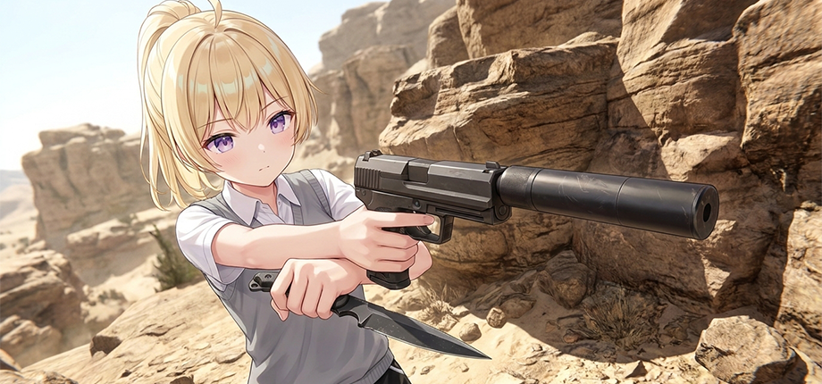

# Overlord

[English](README.md) | 简体中文

Bilibili/Aeka0：https://space.bilibili.com/10077845

允许转载，请附上本项目链接。

Overlord 是《使命召唤：现代战争 2 战役重制版》的 VR 化模组。项目为原有战役加入原生双眼视差画面、6DOF头部与双手追踪、物理枪械操作，以及面向 VR 的装备、场景和剧情交互。适配以游戏原有的武器、弹药、动画和任务逻辑为基础，尽量保留原版的剧情表现。

### **Overlord 由个人独立维护，目前仍处于 Beta 测试阶段，尚未正式发布。项目正经历高强度开发，许多特性仅在作者本人的机器上测试过，仍有大量适配工作需要完成，稳定性预期很差。**

### **请放低预期，将当前版本视为参与测试，而不是成熟产品，也请不要将它与经过长期打磨的作品进行比较。目前已收到在许多机器上出现崩溃、无画面等问题的报告，相关问题仍在调查和修复。**

### **如果希望安装后就能较为顺利地开始游玩，请等待正式版本发布。如果愿意帮助提升稳定性，欢迎下载、测试并通过 [Issue](https://github.com/Aeka0/Overlord/issues) 反馈遇到的问题。感谢关注与支持。**

### **游玩期间仍可能出现部分场景或剧情脚本的适配问题。针对非 VR 客户端制作的自定义 Mod 预期无法在 Overlord 中工作；现阶段可能进行大规模代码调整和重构，不建议在此阶段进行 Mod 开发。版本更迭也可能破坏游戏存档和进度。**

## 已知问题：

- 如果遭遇 `Create2DTexture` 错误，请尝试在游戏内的图形设置中关闭“着色器预载”。
- MSI Afterburner 可能导致 Overlord 无法启动。该问题目前仍在调查，现阶段建议在启动 Overlord 前退出 MSI Afterburner。

## 主要功能

- 立体画面与头部追踪：通过头显观察游戏场景，使用双眼立体视角游玩战役。
- 双手武器操作：使用控制器持握和瞄准武器，支持副手握持、身体收纳和世界武器拾取。
- 物理换弹与上膛：根据武器结构操作弹匣、套筒、拉机柄、弹管、转轮或供弹机构。不同枪械保留各自的操作方式。
- 装备与场景交互：适配投掷物、近战装备、夜视仪及部分任务道具。
- 战役与剧情适配：针对载具、固定武器、攀爬和脚本镜头等场景调整 VR 控制与视角。
- VR 界面与设置：提供原生游戏界面的 VR 呈现，以及带中英文界面、首次设置向导和操作帮助的桌面启动器。
- 舒适度与辅助选项：可调整转向方式、控制器对齐、部分视觉效果和辅助功能，也可配置桌面观看画面。
- 部分可选功能：玩家可自行调整后座力、快捷装弹、辅助瞄准、敌方近战伤害幅度等。

## 运行环境

- 64 位 Windows 10/11 系统。
- 合法持有并安装《使命召唤：现代战争 2 战役重制版》。
- SteamVR，以及能通过 SteamVR 提供头部和双手追踪的 VR 设备。

当前客户端使用 Direct3D 11，默认使用 OpenXR，OpenVR 保留为手动切换的备选后端。已验证的运行组合是 Meta Quest 控制器与 SteamVR/OpenXR；其他设备和运行时需要分别验收。可在启动器的“VR 设置 → 基础 → VR 运行方式”中选择，进入游戏时即生效，无需重启启动器。限制见 [运行时与渲染说明](docs/vr-runtime-rendering.md)。

仓库提供 Oculus Touch（Meta Quest）、Valve Index 和 Vive Controller 的默认输入绑定。但目前只有 Meta Quest 手柄真正进行了实机验证。其他设备可能需要调整运行时绑定及控制器对齐参数。

模组不为盗版或破解版本游戏提供支持。模组发布也不附带原版完整游戏资源或提供下载地址。

## 安装与首次使用

Beta 及正式版本发布时，可从 [Releases 页面](https://github.com/Aeka0/Overlord/releases) 获取安装包；尚未发布时，可参考下方的源码构建说明。

1. 确认原版游戏安装完整。
2. 将 VR 客户端包解压到游戏根目录，运行 `overlord.exe`。
3. 启动 SteamVR，确认头显和控制器已正常连接，然后点击“单人战役”。

使用 OpenVR 备选后端时，首次成功连接会将 Overlord 注册到 SteamVR。普通版本与 Debug 版本分别注册，不共用同一个启动项。

客户端及资源应保持类似以下的相对位置：

~~~text
游戏目录/
├─ overlord.exe
├─ openxr_loader.dll
├─ overlord.vrmanifest
├─ steamvr/
├─ vr_input/
└─ h2-mod/
~~~

客户端编译不会自动将 ZoneTool 资源编译为 fastfile。正式发布前，需要确认基础数据的获取方式、打包范围和完整安装流程；开发者可参考发布准备说明。

## 基础操作

具体按键名称会随控制器和运行时绑定变化。以下使用常见的 Grip（侧握键）和 Trigger（扳机键）名称：

| 操作 | 基本方式 |
| --- | --- |
| 移动 | 左摇杆控制移动。 |
| 转向 | 右摇杆控制转向，可在设置中选择平滑转向或分段转向。 |
| 握持武器 | 手靠近相应握持位置，按住 Grip。 |
| 射击 | 握住武器控制握把后，扣动该手的 Trigger。 |
| 操作弹药和部件 | 空闲手使用 Trigger 操作弹匣、弹药、套筒或拉机柄；动作取决于武器结构。 |
| 收纳武器 | 将武器移到兼容的身体收纳位置，再松开 Grip。 |

不同武器的退匣、装填和上膛方式并不相同。例如，部分武器使用按钮释放弹匣，部分需要手动拔出；泵动霰弹枪、转轮武器和折开式武器也有各自的装填流程，枪膛已经为空时，可能仍需操作套筒、拉机柄或相应供弹机构。请以启动器“帮助”中的对应枪械说明为准。

## 设置与使用建议

首次游玩时，先完成控制器对齐与转向设置，再根据自己的操作习惯调整其余选项。首次向导会立即保存有效选择；完整“VR 设置”页面中的修改使用保存按钮应用。

启动器提供视觉、交互、辅助与作弊选项。建议先熟悉默认操作，再按需调整。调试选项用于定位问题，通常不需要在正常游玩时开启。

启动器语言与游戏语言分别管理。切换启动器的中英文界面，不代表已经下载或切换原版游戏的语言资源。

更新通过本项目的 [Releases 页面](https://github.com/Aeka0/Overlord/releases) 手动安装。当前 VR 版本暂未配置自动更新服务。

## 当前状态与限制

项目仍在开发和发布准备阶段。

- 全部交互仅通过开发者本机验收，无法断言覆盖所有机器。武器、附件、任务道具和剧情场景的适配程度可能不同。
- 设备兼容性和性能表现需要按实际头显、控制器、运行环境与游戏场景验证。目前仅做了针对 Meta Quest 3 的适配。

当前不提供未经验证的最低硬件配置、性能承诺或“全流程无问题”保证。已确认的兼容性、已知问题和版本变化将在正式发布说明中列出。

## 从源码构建

请使用 Git 克隆仓库并初始化子模块。直接下载 GitHub 的源码 ZIP 不会包含所需的子模块内容。

准备 Visual Studio 的 C++ 桌面开发工具和 Windows SDK，在相应的开发者命令提示符中执行：

~~~bat
git clone --recurse-submodules https://github.com/Aeka0/Overlord.git Overlord
cd Overlord
generate.bat
msbuild build\overlord.sln /t:client /m:2 /p:Configuration=RelWithDebInfo /p:Platform=x64 /p:PreferredToolArchitecture=x64 /p:CL_MPCount=4
~~~

`generate.bat` 生成 Visual Studio 2022 工程。默认工具集为 v143；如果使用已有的 Visual Studio 2019 v142 工具链，应先执行 `tools\premake5.exe vs2019` 生成工程，再使用对应的 x64 MSBuild，并指定 `/p:PlatformToolset=v142`。

| 用途 | 构建配置 | 客户端文件 |
| --- | --- | --- |
| 正常游玩与性能检查 | `RelWithDebInfo` | `overlord.exe` |
| 开发与问题诊断 | `Debug` | `overlord-debug.exe` |

构建输出位于 `build/bin/x64/<Configuration>/`。请使用同一次构建产生的程序与资源，不要混用不匹配的版本。

构建细节、按改动选择的检查项目及资源部署方式见[开发说明](docs/development.md)；其余技术主题见[文档索引](docs/README.md)。这些开发文档目前主要使用英文。

## 问题反馈与参与开发

反馈前请先搜索[已有 Issue](https://github.com/Aeka0/Overlord/issues)。中英文报告均可，建议提供：

- 使用的版本或提交编号。
- 头显、控制器、Windows、VR 运行时版本，以及所选的 OpenXR/OpenVR 后端。
- 出现问题的任务、检查点、武器或操作场景。
- 能够复现问题的步骤，以及预期表现与实际表现。
- 必要的错误文本或经过删减的日志片段。

请勿在公开 Issue 中上传游戏文件、访问凭据或未经检查的完整内存转储。涉及个人敏感信息的报告方式见[安全说明](SECURITY.md)。

参与开发前请阅读[贡献指南](CONTRIBUTING.md)。修改应尽量复用现有组件，保留原生游戏逻辑的职责边界，并明确区分源码检查、自动测试与真实设备验证。

## 许可证与致谢

项目代码采用 [GNU GPLv3](LICENSE)。第三方代码、字体及其他资源保留各自的许可证与版权声明，详见[第三方声明](THIRD_PARTY_NOTICES.md)和[来源清单](docs/source-provenance.md)。

VR 适配由 [Aeka0](https://github.com/Aeka0) 独立维护。本分支与上游项目及其作者无隶属关系，也未获得其背书，请勿骚扰上游作者。VR 改动的维护与问题反馈由本项目负责。

基础代码源自 H2-Mod 及其更早的上游项目 [IW6x](https://git.alterware.dev/alterware/iw6-mod) 和 [S1x](https://git.alterware.dev/alterware/s1-mod)。

同时保留对以下项目和贡献者的致谢：
[momo5502](https://github.com/momo5502)、
[JariKCoding](https://github.com/JariKCoding/CoDLuaDecompiler)、
[xensik](https://github.com/xensik/gsc-tool)、
[ZoneTool](https://github.com/ZoneTool/zonetool)、
[quaK](https://github.com/Joelrau)，以及 Valve、Khronos 和 REFramework 的相关工作。

本项目是独立的社区模组，并非官方游戏版本。游戏名称及商标归各自权利人所有。本项目作为学术研究存在，严禁用于盗版和破解、越权和攻击行为，违规使用责任自负。
