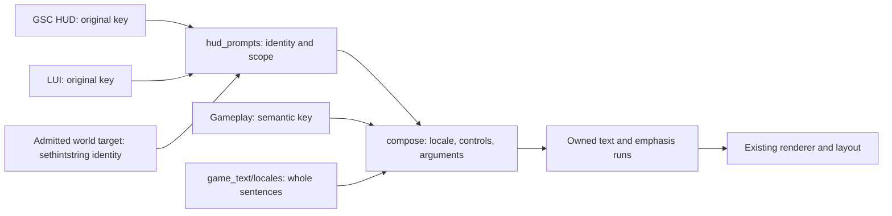

# In-game text and VR action prompts

All existing VR action instructions now use `vr::hud_prompts`. This includes
the Whisky Hotel flare and earlier native hint replacements, generated story
instructions, world use/pickup/resupply, and the LUI cinematic skip instruction.
The approved sentences and native display lifetimes are preserved.

The shared translation foundation remains `component/game_text.hpp` and
`game_text_catalog.hpp`. Translated sentences are separated by language in
[`component/game_text/locales/`](../src/client/component/game_text/locales/README.md).
Game text follows native `loc_language`, independently
of launcher language. All 14 written locales used by the 17 official language
packs cover every existing semantic key, including reviewed mission and trainer
instructions. Russian, Japanese and English content/voice editions share their
written catalogs; the two Spanish packs share neutral controller instructions.
The MOD-only Czech and Turkish catalogs retain partial coverage. Missing action translations retain the
current game's original complete instruction, not the MOD's English text. This
refactor does not change unreviewed trainer prompts.

For each prompt, document the native source identity and operation in the locale
catalog, then maintain the complete localized sentence and its typed parameter
schema together. Do not add placeholder English. Parameter contracts are language independent
(`game_text::parameters`); a key needs at least one real translation, not an
English reference.

## Ownership and entry points



- `vr/hud_prompts.hpp` is the engine-independent registry, scope policy and
  composer. A definition binds a semantic message to its operation. Native
  rules bind exact source keys to a producer, map and required feature.
- `vr/hud_prompts.cpp` supplies the current runtime context for recognized
  native keys. It reads existing feature availability; it never changes script
  flags, input or mission state. Unknown keys return immediately.
- `game_text/locales/` owns one named-entry catalog per language.
  `game_text/catalog_types.hpp` defines semantic keys, locales and catalog types;
  `game_text_catalog.hpp` assembles them and validates named-parameter contracts.
  `game_text.cpp`/`game_text_native.hpp` map the native game language. Russian
  and Japanese content/voice editions share their written-language catalogs.
- Native bridges only forward source identity. Gameplay selects a semantic
  instruction while its existing state machine authorizes display. Renderers
  handle fonts, dimensions, wrapping, color and scene ownership.

There is no global replacement of native localization assets. Dialogue,
subtitles, mission names, weapon names and unrelated menus remain native.
Non-action captions such as chamber state, quick reload and recording-preview
labels already use `game_text::text`; they do not need native prompt rules.
These MOD-only captions have no original instruction to restore; their existing
base-catalog fallback is outside native prompt replacement.
Launcher i18n and developer diagnostics are separate systems.

## Audit and migration inventory

| Instruction | Original source identity | Scope | Shared message / operation |
| --- | --- | --- | --- |
| Estate mine | `ESTATE_LEARN_PRONE`, `_TOGGLE`, `_HOLDDOWN`; `maps/estate_code` control-based hint registrations | Script HUD, `estate`, VR | `mine_prone` / right stick down |
| Takedown vehicle duck | `FAVELA_DUCK_HINT`, `FAVELA_DUCK_HINT_KEYBOARD`; native script HUD | Script HUD, `favela`, VR | `vehicle_duck` / right stick down |
| Whisky Hotel flare | `SCRIPT_PLATFORM_HINTSTR_POPFLARE`, keyboard alias; `_id_C660::display_hint("how_to_pop_flare")` | Script HUD, `dc_whitehouse`, physical flare adapter active | `signal_flare` / no button placeholder |
| Cinematic skip | `PLATFORM_HOLD_TO_SKIP`, `PLATFORM_HOLD_TO_SKIP_KEYBOARD` | LUI, VR; optional leading `@` | `cinematic_skip` / complete sentence |
| Team Player M203 reload | `SCRIPT_LEARN_GRENADE_LAUNCHER`; `maps/roadkill_code::_id_D36C` selects `learn_m203` | Script HUD, `roadkill`, enabled physical adapter with an admitted held M203 | `m203_reload` / open breech, waist supply, insert, close |
| Rappel brake | Existing `sequences/rappel` descent state | Generated story instruction | `rappel_brake` / Trigger |
| Story guard kill | Rappel melee state; Oilrig `SCRIPT_PLATFORM_OILRIG_HINT_STEALTH_KILL` | Rappel generated instruction; Oilrig original script HUD lifecycle | `story_melee` / Trigger |
| World use, pickup, resupply | Current native interaction target and physical hand(s) | Generated world instruction | `interaction_use`, `interaction_pickup`, `interaction_resupply` / Grip |

Previous independent implementations have been removed:

- `menu_text.hpp` and its LUI-specific sentence lookup;
- `narrative_ui::replacement_hint`, vehicle/flare key predicates, and the
  Estate translated-sentence/binding matcher and cached hint strings;
- renderer-local assembly of operation labels and color escapes in the
  generated story/world action instructions.

`native_waypoints.cpp` obtains the original label/text key from the validated
HUD config-string fields and calls `hud_prompts::replace(source::script_hud, key)`.
Missing identity preserves native text; translated prose and binding glyphs
cannot authorize replacement. `ui_scripting.cpp` forwards the existing
single-key `Engine.Localize` calls through `replace(source::lui, key)`; unknown
keys, missing translations and variadic native formatting retain the original
function. Neither bridge translates the original sentence a second time.

Generated story instructions are omitted when their exact-locale translation is
incomplete; their native script reminders continue on the narrative canvas with
their original wording, bindings and timing. For world prompts, the complete
use/pickup/resupply family and Grip labels are one presentation owner. If that
family is incomplete, custom world text is disabled and the stock cursor-hint
text is admitted to the existing narrative canvas. This preserves the actual
native text rather than inventing a substitute template or displaying nothing.

For recognized mission use targets, the admitted server snapshot carries the
native hint index (1..31). The frontend resolves that identity from the separate
`0xd5` config-string range, then uses the same scoped registry. The verified
non-actor setter and native hint reader both use `gentity+0xb5`; actors are
excluded. This does not add a candidate, alter native admission, or execute the
script VM from rendering. DSM connect/recover, ropes, breach, world pickups and
museum warnings therefore retain the original trigger's lifecycle. A missing
translation for a recognized specific hint also returns its native cursor text
to the narrative canvas, even if the generic use family has translations.

The cursor fallback wraps the verified original ownerdraw call at `0x14038AF9C`
to `0x1403869F0`, with its original client/rect/font/scale/style arguments. A
bounded read-only witness confirmed the entry, caller and argument setup.
The original function executes once; its native localization, command bindings,
parameters and target selection are untouched. The adapter records only its
exact allocation range using the existing fingerprint/expiry contract.

The narrative renderer still classifies native DSM labels for progress-plane
placement. That does not rewrite their text. Its copied classification labels
now refresh when the game language changes.

## Composition and fallback

```cpp
// Gameplay has already established a visible story action.
const auto message = vr::hud_prompts::compose(
    game_text::key::rappel_brake, game_text::current);
if (message)
    draw(vr::hud_prompts::text(*message, vr::hud_prompts::style::native_colors));

// World rendering retains individual emphasis runs and native item names.
const auto pickup = vr::hud_prompts::compose(
    game_text::key::interaction_pickup, game_text::current,
    {hand_index, shared_target, native_item_name});
// Render pickup->parts using existing measurement and color handling.
```

Call `game_text::current` once per generated UI transaction. Native lookup
does this inside the common runtime entry. Neither path caches translated
instructions, so a language change takes effect at the next draw.

The composer resolves the complete sentence, its operation label and any
generic missing-item noun in the exact current game locale. If any required
translation is absent, composition declines the override for the whole
instruction. The original producer retains the current game's own wording;
there is no cross-language MOD fallback and no mixture of translated fragments
with an English control label. An unknown/unavailable game locale also declines
the override. Native item names remain literal
values supplied by their native localization owner. Template arguments are not
recursively interpreted. Invalid hands, embedded-NUL item names, malformed
templates and oversized output are rejected.

`message.parts` owns its strings and emphasis. The native-text serializer adds
`^3`/`^7` around emphasized controls and interaction locations; world text uses the same runs with
its existing color draw calls. Templates own word order and spaces. Chinese
spans remain adjacent; the world renderer still accounts for native font-width
handling of leading/trailing spaces and trims item names only at UTF-8 boundaries.

Chinese templates mark literal controls and locations with `<em>...</em>`;
typed `{button}` arguments are also emphasized. Tags are consumed by the shared
formatter and never shown as glyphs. Nested/unbalanced/unknown tags reject the
whole sentence. Arguments remain literal, including any tag-looking item name.
Chinese action instructions omit sentence periods; warning exclamation marks
may remain. Historical native originals in review documents retain punctuation.

The base formatter caps output at 4,096 bytes, eight arguments and 16 runs.
Prompt serialization includes its color markers in that byte budget. Source
identity lookup is exact, bounded and restricted to its producer/map/feature;
an unavailable adapter, disabled VR, missing key or failed formatting leaves
the original native text intact. No polling job, per-language replacement
cache, script VM call or render-worker synchronization was added.

## Adding or revising a prompt

1. Record the native key, producer, script selection/display call, lifetime,
   and the actual VR action. Loaded localization or `precachestring` alone is
   not evidence that the prompt is displayed. Keep unaudited candidates separate.
2. Add/reuse a typed semantic key in `game_text/catalog_types.hpp` and a complete
   sentence in the appropriate `game_text/locales/<language>.hpp` files.
   Record its named-parameter schema independently in `parameters(key)`;
   Chinese-only additions are allowed. Save language files as UTF-8 and use readable native text in `u8`
   literals. Their `.editorconfig` specifies UTF-8; Premake supplies MSVC
   `/utf-8` for every configuration and test target, including PCH compilation.
   Entries explicitly name their keys and may be reordered.
   Keep untranslated entries absent so the native fallback still applies.
3. Add one `hud_prompts::definition` identifying the operation. For native
   replacement, declare all known controller/keyboard aliases and their exact
   producer, map and feature requirement in `native_rules`. New feature gates
   are supplied by the common runtime adapter from read-only gameplay state.
4. Existing native bridges need no new conditions. Generated HUD code calls
   `compose`; it does not select a button translation, concatenate a sentence,
   or compare displayed text. Gameplay continues to own action availability.
5. Cover positive and negative source identity, feature/mode scope, locale
   changes, preservation of the original native text on missing translation,
   argument/highlight preservation and
   bounds. Verify actual visibility and final headset layout separately.

Compilation checks every nonempty translation against its typed, language-independent
parameter set. Parameters may move or repeat but cannot be dropped, invented,
misspelled or left with unmatched braces. The prompt registry also checks
unique semantic definitions/native aliases and operation-placeholder agreement.

Each catalog is validated in its own constexpr evaluation to keep the build
within the supported compiler's step budget as translations grow. Runtime text
limits and the native producer/mission/feature gates are unchanged.

## Verification boundary

Spatial-panel tests cover all native rules and all game locales, language
switching without cached text, source/feature rejection, native fallthrough on
missing translations, generated story/world instructions, UTF-8 sentences,
placeholders, color bounds and native WARP
composition. Menu-surface and hand-interaction regressions cover the existing
skip and flare consumers. Debug and optimized client compilation is separate
from live-game acceptance.

This migration changes text routing only. Input contracts, mission events,
native hint timing, DPI scaling and light/dark presentation stay with their
existing owners. A missing translation returns to native hint position/timing,
including the stock cursor hint instead of the custom world label. In-headset
wrapping, fonts and language-specific
appearance still need acceptance; fallback does not imply a full translation.
