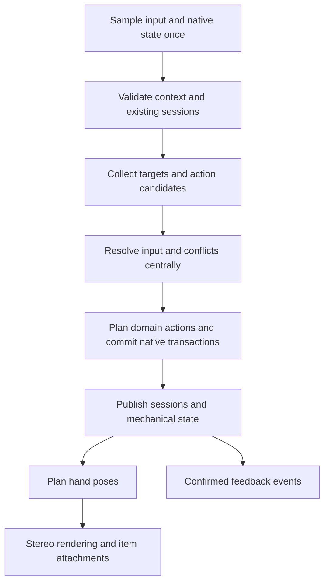

# Hand-interaction architecture

This document defines the unified hand-composition contract. The current
implementation and its validation boundaries are described in the
[hand-interaction runtime guide](vr-hand-interaction-runtime.md).

## 1. Recommendation and scope

Establish one hand-interaction system advanced by the game-logic thread. It owns input intents, candidate selection, grasp relationships, composition compatibility, and hand-pose plans. Weapons, reload, equipment, and world interaction provide specific abilities and transactions; the unified system decides which one receives each input.

Retain the verified ammunition conservation, native engine adapters, weapon-instance identities, mechanical cores, model-structure bindings, and mirroring/IK tools. Redesign their hand-interaction contract to remove cross-module `busy` queries, exceptional bypasses, and behavior determined by execution order.

Scope to migrate in this pass:

- Primary weapon grip, support grip, dual wielding, body holstering, and existing hand-transfer rules.
- Existing hand operations for magazines, ammunition, slides/charging handles, pumps, break actions, revolvers, and similar mechanics.
- Grasping, operation, and ammunition draws for M203, GP-25, and underbarrel shotguns.
- Forward/reverse tactical-knife grips, knife + magazine, knife + slide, and existing melee suppression.
- Heartbeat sensor, world-target grasp/use, and targetless script-interaction notifications.
- Empty-hand presentation and the contract needed to add future gestures and tactical equipment.

The four Grip/Trigger-driven empty-hand poses belong to this system. Gesture
recognition and complete tactical-equipment throwing/fuse behavior are separate
features. Locomotion, native damage calculations, level scripts, and resource
loaders keep their existing owners.

### Relationship to the existing design

The [global interaction architecture](vr-gameplay-interaction-architecture.md)
defines unified input, global arbitration, and separation of engine transactions
from presentation. This document specifies the hand-composition contract used
by that architecture.

The earlier simplified “one exclusive operation lease per hand” model must become “one validated hand composition.” This can represent one hand holding a knife while pinching a magazine, or one grasp that supplies both support aim and sliding ability. Some earlier statements that a feature was “not yet implemented” are outdated and must not be treated as current code facts.

## 2. Review baseline: facts, effects, and retained behavior

Paths below are relative to `src/client/component/vr/`. Line numbers were entry points for this review; migration should follow symbols.

| Observation | Code/evidence entry | Architectural effect |
| --- | --- | --- |
| Input backend already publishes immutable frames with physical left/right hands, press/release counters, and generations | `controller_input.hpp`, `digital_sampler`, `frame` | Retain sampling and unify downstream consumption; do not add a second XR sample |
| `carry` separately asks world, sensor, underbarrel, knife, and mechanical modules whether a hand is occupied | `gameplay/weapon_carry_runtime.cpp:193,519` | “Available” depends on caller; `allow_knife` spreads one composition exception into a public API |
| Underbarrel advances during carry update, while ordinary reload, revolver, and tube weapons register their own server ticks | `weapon_carry_runtime.cpp:409,638`; `physical_reload_runtime.cpp:563`; `cylinder_runtime.cpp`; `tube_runtime.cpp` | The same input may see different occupancy/mechanical snapshots by update order; sharing a server thread does not make a unified decision |
| Modules each own button gates, action leases, and hand state | `grip_edges.hpp`, `digital_button_gate.hpp`, `physical_reload_gesture.hpp`, `underbarrel_runtime.cpp` | Rejection, cancellation, and rearming rules are scattered; correct module-local edges do not prove cross-module correctness |
| Render scene frames carry input, operability flags, and geometry; some logic waits for rendering to confirm an instance | `physical_reload_runtime.hpp::scene_frame`; `physical_reload_runtime.cpp:202` | Valid render-cache lifetimes are mixed with this frame's logic input; separate immutable bindings from logic contact samples |
| A prior ammunition draw succeeded, but the new field rejection came from targetless world interaction | Local `occupancy-details.jsonl`: rejection had `worldMask=1` and `use.key.entity=-1`; primary reload had no slide/seated/grabbed/magazine-hand state | A Grip script notification was misrepresented as entity occupancy; do not attribute every failure to the primary magazine |
| Empty M203 action grip directly disables two-hand aim | `hands/component.cpp:628`; `weapon_carry_runtime.cpp::pose` | “Allow slide operation” was wrongly equated with “remove support control” |
| Knife + reload already has complete, valuable composition behavior | `physical_reload_runtime.hpp:56`; `knife_reload_tests.hpp`; `knife_slide_tests.hpp` | Promote it to a formal composition contract while retaining independent releases and pose-latching rules |
| Knife suppresses melee during reload through a query into reload modules | `equipment_runtime.cpp`, `part_leased` call | Committed hand composition should grant action permission instead of each equipment type querying every module |
| Several presenters overwrite wrist/finger bones in sequence, coordinating through `posed_hands` and dedicated fields | `hands/component.cpp`; `equipment_runtime.cpp::present`; `physical_reload_presenter.cpp` | Final hand shape/attachment can depend on call order; compose one pose plan |
| Grenade source pose uses a parent node while the actual mesh child has another animation offset | `weapons/attachments/underbarrel_poses.hpp`; local asset audit | A grasp recipe must constrain fingers, contact, and real mesh transform together; a runtime offset fix alone cannot guarantee other poses |

### Local experiment baseline before redesign

The installed version at review time was the prior candidate, with EXE SHA-256 `74db05db575319a0cfa028bdd321186147e5d864d556283e1aad52d67a66d6ba`. It supplied the field rejection evidence; it is not the redesigned candidate's build identity.

The working tree before the pause contained three local experimental changes that had not been built or deployed: `world_interaction_policy.hpp::owns_hand`, the occupancy mask in `world_interaction.cpp`, and corresponding test assertions. Retain their diagnostic value, then merge them into the unified model or remove them during implementation. They do not count as redesign results. The earlier underbarrel work also had many uncommitted changes; migration must not reset the entire tree.

Two bounded passive Frida observation sessions ended and detached without changing parameters, return values, or ammunition. Record draw evidence, source inference, and model-asset measurements separately. In particular, the exact reason for each SCAR common-grip rejection had not been captured; a new architecture cannot yet be claimed to have fixed it.

## 3. Core model: manage hands, objects, grasps, abilities, and poses separately

Do not collapse a hand into `Free / Busy / Reloading` or expand every possible combination into one huge enum. Use these small objects:

| Object | Stores | Does not own |
| --- | --- | --- |
| `InteractionFrame` | One calibrated physical input, body space, context, and observation revision | A “hand available” boolean that modules can overwrite |
| `TargetHandle` | Object-instance generation, component/grip identity, and binding generation | Weapon name, bare bone pointer, or native selected token alone as identity |
| `Affordance` | Touchable grip/operation surface, input requirements, position/facing conditions, acquisition/retention rules, and available abilities | Direct ammunition deduction, hand capture, or skeleton edits |
| `InteractionSession` | Established hand-to-target relationship, sustaining input, contact origin, selected recipe, and independent lifecycle | Guessing whether another module occupies the hand |
| `HandComposition` | Sessions allowed to coexist on this hand and their pose/input contract | Allowing arbitrary objects to coexist merely because occupancy masks differ |
| `DomainState` | Existing weapon mechanics, equipment state, ammunition custody, and native results | Cross-module hand priority |
| `HandPosePlan` | The hand's single wrist target, finger recipe, object attachments, and constraints | Deriving a new grasp, shot, or ammunition deduction from rendered pixels |

A session carries `session_id`, physical hand, target identity, input origin, context/reference/binding generations, composition recipe ID, and state. States must at least distinguish active, tracking temporarily unavailable, and awaiting transaction settlement. End reasons use enumerable codes.

Carry and native adapters still maintain weapon inventory and location. Sessions generate primary/support relationships. The old `hold` can remain a read-only projection for existing combat logic, but must not remain a second writable hand truth.

### 3.1 Two kinds of composition

1. One grasp with multiple abilities: the M203 foregrip provides `SupportAim` and `SlideAction`. The grasp continues while mechanical conditions change which abilities are available.
2. Multiple objects in one hand: Grip sustains a knife while Trigger sustains a magazine or slide pinch. Only resource- and behavior-validated composition recipes allow both at once.

Do not make two mutually exclusive sessions compete for the M203 foregrip. Likewise, do not invent one hybrid object or one shared release button for knife + magazine.

### 3.2 Composition compatibility

Resource requirements can describe palm grasp, pinch, index activation, wrist constraint, touch, and so on, but a mask is only a fast rejection aid. Final admission must match an explicit composition recipe covering action permissions, both object attachments, finger pose, and release/degradation rules.

| Composition | Proposal |
| --- | --- |
| Primary weapon control grip + other-hand support | Retain; support does not change main Trigger ownership |
| M203 support grip + sliding at the same point | One session provides both abilities |
| Knife + magazine/slide | Reuse verified recipes for four pistol families and both-hand mirroring; other weapons require separate validation |
| Held magazine + same-hand grenade | Conflict; a new button must not overwrite an object already in custody |
| Real world-object use + incompatible ammunition draw | Conflict; report real target and occupancy reason |
| Targetless script notification + empty-hand ammunition draw | Notification does not occupy the hand; a new entity operation ends the notification and keeps native press/release paired |
| Decorative empty-hand gesture + acquisition | Gesture owns no occupancy; legal acquisition takes over presentation |
| Tactical equipment + other objects | No composition recipe by default; register explicitly when extended, without inheriting knife exceptions |

## 4. Per-frame execution contract

The proposed `hand_interaction_runtime` provides the sole server update entry and calls providers explicitly. Maintaining sessions, collecting candidates, deciding, committing, and publishing form one bounded logic batch. Do not implement this as a global event bus whose subscription order determines outcomes.

Sequence:

1. Obtain one `controller_input::frame`, body space, and native observation with a fixed revision.
2. Handle context changes, destroyed objects, and proven releases; update existing sessions' retain/pause/end intents.
3. Providers read the same input and state and emit candidates or requests to advance existing actions.
4. Consider both hands and shared objects together to select compatible requests. A better-scoring new candidate must not steal an existing relationship.
5. Run domain planning and native compare-and-commit for winners. Failure ends this intent; the same Trigger must not become another draw or firing action.
6. Publish one new snapshot from pure hand relationships and successful transactions. Preserve necessary prior settlement and reentrancy protection if commit invokes native callbacks.
7. Build and publish pose, model, and feedback plans once. Rendering and audio consume the same committed version.

Fire cadence and external native changes can occur without input edges. The coordinator may advance mechanics/cadence on every simulation tick; only input events are deduplicated by frame/generation/counter. An automatic weapon's sustained Trigger belongs to its existing activation stream and does not repeatedly reenter global candidate competition.

### 4.1 Input-consumption boundaries

- Grip/Trigger are physical facts. `Select`, `Activate`, `DrawSupply`, and `Release` are interpreted operations.
- Holding Grip with an empty hand does not itself imply an item or create a generic occupying session.
- Each input event has one decision record. Multiple composed actions must be explicitly expanded by one selected intent.
- If Grip and Trigger both change in one sample, apply current composition rules; do not invent an order the backend did not observe.
- An existing session receives its own release even if a new target scores higher or tracking is invalid. Missing world coordinates may defer a placement transaction but must not erase a known release.
- Fix the ammunition type on a successful draw. Releasing Grip, changing mode, or moving the hand afterward must not change the held ammunition identity.
- Entering the waist with Trigger already held is not a new draw. Retain the existing knife-acquisition 200 ms intent window as an explicit policy of that affordance, not automatic snapping for every object.
- Focus, reference, and device-generation changes rearm centrally; domain modules must not each implement a different recovery rule.

### 4.2 Candidate decisions

Hard-filter identity, context, input, mechanical permission, and composition compatibility before ranking valid candidates. Suggested order: release/advance existing sessions, activate selected targets, direct contact, body supply/holster, distant world interaction, targetless script notification. Process decorative empty-hand poses after action selection.

One global numeric priority table cannot solve all cases. Primary and secondary ammunition in the same waist region first need semantic target selection: empty hand + Grip + new Trigger selects the current weapon's secondary ammunition; without Grip, select the primary magazine. If selected secondary supply is empty, return an explicit rejection rather than falling back to a primary magazine.

While a knife is held, “Grip held” sustains that knife and does not satisfy “empty hand + Grip.” Continue using the verified knife + primary-magazine rule. Knife + underbarrel ammunition needs its own future composition recipe.

Rank geometry by normalized distance, facing quality, and continuity; avoid rapid toggling when scores are close. Store separate acquisition and retention thresholds. Do not enlarge initial grab range just to prevent later drops. Randomizing candidate traversal order should leave the result unchanged.

## 5. M203 common grip and motion constraint

### Defined product behavior

- The M203 primary-weapon support position and chamber-tube operation point are the same physical contact.
- A held grip preserves support aiming; a mechanical lock only prevents sliding.
- An empty chamber can be opened directly; closing it keeps the grip.
- The firing position retains a separate grasp region and facing condition; the ordinary GP-25 support grip can activate the underbarrel Trigger.
- Underbarrel-shotgun pumping retention tolerance is separate from initial acquisition and firing conditions.

M203 no longer switches main-weapon control between mutually exclusive `action` and `support` grasps. A session stays bound to the common foregrip; internal mechanics decide whether sliding is free. Open/closed endpoints commit mechanical events without releasing and reacquiring the hand.

### Proposed constraint solver

Use simultaneous raw poses of both physical controllers, the immutable grip binding, and the last committed mechanical travel to solve gun facing and one-dimensional slide travel together. Never infer mechanical motion from bones already moved by this frame's hand IK.

- The primary hand provides weapon position and roll reference; the support-hand direction provides auxiliary facing.
- Under the M203 bound forward-axis geometry, constrain axial travel from changes in hand spacing and grip-point offsets.
- At lock, fix travel while the support hand can still change facing.
- When unlocked, solve within bounded travel using acquisition-origin compensation, endpoint hysteresis, and tracking-jump detection.
- Constant-radius support-hand rotation around the primary hand mainly changes facing and must not open the chamber. Translating or rotating the whole weapon must not change travel either.
- A real motion containing both turning and sliding may affect both.

This constraint scheme needs dedicated validation. Two point positions do not always uniquely determine full rigid rotation and axial movement. Specify the primary-hand roll reference, degenerate spacing, exceptional axis directions, and noise handling; “hand spacing equals travel” is not a proven algorithm. If hands are too close or geometry degenerates, freeze mechanical advancement with a reason while retaining any grip relationship that remains reliable.

Acquisition, retention, and visual fit use one binding ID and constraint description. Physical ranges must not be adjusted independently by presenters. Validate M4, airport M4, SCAR, M16, and ACR against their actual receiver/attachment bindings, rather than passing on only one token.

## 6. Tactical knife and shared grasps

Existing forward/reverse grip, chest draw, Grip-release return, and knife + magazine/slide behavior for four pistol families are the migration baseline.

Each hand may own one approved composition whose child sessions record sustaining input independently:

| Action | Composition change | Must preserve |
| --- | --- | --- |
| Trigger pinches a magazine/slide while holding a knife | Create the Pinch child session and select the shared pose recipe | Knife Grip and native object identity |
| Release Trigger first | End Pinch; knife returns to its own grip presentation | Do not return knife or trigger a new action |
| Release Grip first | Return knife to chest under existing rules; Pinch continues | Magazine/slide contact and shared-grasp reference until this Pinch ends |
| Release both together | Settle each owning release/transaction | Do not eject ammunition twice or miss a release because of call order |
| Shared reload in progress | Composition disables blade melee for this hand | Pose transition and slide pull cannot be mistaken for a knife swing |
| Pinch ends while knife remains | Reset motion-detection history before re-enabling melee | Reload velocity cannot become a new strike |

Visual transitions may be smooth, but magazine contact reference must not change while Trigger is held, or the object will jump. Clear the latched shared-grasp recipe only when composition ends; the next ordinary draw must not inherit it.

## 7. Poses and item attachments

Generate one pose plan per hand: wrist target, finger recipe, rigid item attachments, and necessary visual limits. Each domain declares requirements, then one composer produces the result. The last skeleton writer must not determine the pose.

Organize grasp resources as `GraspRecipe`:

- Logical contact surface/axis and acquisition/retention thresholds, unaffected by artistic wrist rotation.
- Left-hand source pose, mirroring method, and complete finger pose.
- Wrist-to-actual-rigid-mesh transform, not merely a transform to a parent with animated offsets.
- For shared objects, each object's independent in-hand transform and release/degradation recipe.
- Source model/animation hash, sampled frame, units, child bones involved, and validation measurements.

The existing grenade offset must be fixed in the asset pipeline before entering the new system: bake the transform of the child bone that carries the actual mesh and select a frame whose fingers truly grip the projectile. M203, GP-25, and shotgun assets cannot share an unverified hand shape simply because all are “ammunition.”

Logical reload contact must use the same rigid object attachment. Drawing, display, and insertion detection must not each use a different anchor. Body space and mechanical travel use meters; convert to existing skeleton/engine coordinates only at explicit boundaries.

Rendering may use fresher predicted poses to improve appearance but can only redisplay selected sessions/items. Invalidate cached bindings by instance and assembly generation. Frustum culling or a missed render must not cause an existing logical interaction to lose identity. If the first valid binding is unavailable, explicitly report “asset not ready” and reject new acquisition.

## 8. Empty-hand gestures and tactical-equipment extension

### Empty-hand gestures

Separate visual pose selection from semantic actions with game effects. A visual gesture is low-priority presentation when no item is held; it neither occupies the hand nor affects waist draws. A semantic gesture must create an intent with a new event ID and pass through the same arbitration.

Future controller buttons, stick menus, or actual gesture recognition can provide observations through the input adapter. Finger states not observed by the current device must not be invented as recognition results. Permit switching only in legal empty-hand contexts. Acquisition, release, and tracking recovery must not incidentally trigger a gesture action.

### Tactical equipment

A body slot proposes a candidate linked to native inventory. A successful draw establishes an equipment session with fixed identity. Grip to sustain and Trigger to activate are only proposed default bindings; pin pull, throwing, fuse, and tracking-loss behavior need confirmation in that feature's design.

Reserve the `select / activate / release / context_lost / native_outcome` contract. An item with an activated fuse must not inherit the magazine policy of “cancel and refund to inventory”; equipment domain logic and native results decide settlement. A held but unactivated item must not auto-activate or throw when input recovers.

## 9. Transactions, lifecycle, and concurrency

### 9.1 Unified arbitration without a second ammunition ledger

Retain the existing `plan → native compare/commit → settlement` sequence. The hand system reserves interaction resources and submits domain requests, then publishes sessions on success. On failure, record the reason and consume that intent.

Identity must include at least input event, session, native timeline, target instance, and mechanical revision. For multistep native calls, use validated domain adapter steps and compensation policies. Multiple external writes are not a generic atomic transaction that can automatically roll back. A fired projectile or applied damage cannot be refunded by retry or cancellation.

If compare-and-write fails while canceling ammunition custody, retain a bounded `settling` record and occupancy until native coordination completes. Do not announce the hand as empty and later refund twice. Old custody must not be refunded into a new instance after a level/checkpoint transition.

### 9.2 Lifecycle rules

| Change | Unified handling |
| --- | --- |
| Brief tracking loss | Stop new acquisition, firing, and sweeps; pause constraints by session policy rather than assuming release from disappearance |
| Release received without reliable hand position | Record the release; defer position-dependent placement as needed, but never swallow the release |
| Focus/menu/script takeover | Suppress intents and terminate activation notifications in pairs; retain mechanics or settle custody according to domain policy |
| Recenter/unit change | Clear old motion history and establish a new coordinate baseline; no sweep across generations |
| Weapon replacement, attachment change, target destruction | Invalidate target handle and request domain cancellation/coordination; do not transfer to a same-named new weapon |
| External native ammunition changes | Existing mechanical coordination handles these; sessions must not mint ammunition |
| Exit/checkpoint load | Clean up once and publish an invalidated snapshot; workers discard stale results by generation |

### 9.3 Threads and capacity

Arbitrate both hands and shared objects and perform native writes on the game-logic thread for an explainable order. Asset resolution, binding construction, pure geometric preprocessing, rendering, and diagnostic writes may run in parallel on existing workers. Parallel outputs carry binding generations; logic must not block waiting for render frames or violate native-engine thread constraints.

Use bounded containers for candidates, sessions, transactions, and diagnostic rings. Existing sessions and settlement records cannot be dropped on capacity exhaustion. Overflow of new candidates must be reported and handled deterministically, not by container iteration order. Avoid heap allocation, string concatenation, full asset scans, and calls into other modules/native engine while holding a lock on hot paths. A publication lock only performs a short snapshot exchange.

Measure capacity and time budgets against existing scene baselines before setting thresholds; this document does not invent performance measurements. Prioritize consistent behavior for both hands rather than adding cross-thread synchronization for very few candidates.

## 10. Module placement and dependency direction

Centralize shared components under `gameplay/hand_interaction/`, with provisional names:

| Module | Responsibility |
| --- | --- |
| `types.hpp`, `input_intents.hpp` | Identity, sessions, frames, intents, and event deduplication |
| `affordance.hpp`, `composition.hpp` | Candidate contract, composition permission, and grasp-recipe references |
| `arbiter.hpp` | Deterministic arbitration without engine dependencies |
| `constraints.hpp` | Shared rigid-body/slide/rotation constraint tools |
| `runtime.cpp` | Single server orchestration, domain calls, commit, and publication |
| `pose_plan.hpp` | One composed hand-presentation plan |
| `diagnostics.*` | Decision reasons, bounded history, and replayable records |

Weapon and equipment directories retain their providers and mechanical implementations. The shared layer depends only on common contracts, not on concrete modules such as `underbarrel_runtime` or `knife_profile`. The top-level runtime composes them explicitly. A general ECS, dynamic plugin system, or scripted state machine is not prerequisite.

| Existing entry | Migration target |
| --- | --- |
| `carry::busy / hand_available(allow_knife)` | Replace with composition queries and remove per-domain occupancy probing |
| Writes to primary/support hands in `carry::hold` | Read-only projection after session commit; inventory location still belongs to carry |
| `physical_reload` directly querying underbarrel | Route supply intents centrally; mechanical core no longer knows whether underbarrel competes for the hand |
| Separate server gesture ticks | Bring into unified frame orchestration; retain native boundary hooks and pure mechanical rules |
| `equipment::busy` and knife/reload exception | Equipment session plus approved shared-grasp recipe |
| Mixing world notifications with `lease_hands` | Separate target sessions from native-command notification flow |
| Render support gating and skeleton overwrites by modules | Read the unified pose plan; rendering no longer grants logical acquisition |
| Local status commands each interpreting rejection | One decision record with domain details attached |

## 11. Migration plan: each phase has an old path to remove

The endpoint of the full redesign is that all consumers above follow one contract. Phasing allows validation; it must not leave two systems able to decide grasps indefinitely.

1. Fix baseline and replay: preserve recent failed input, installed binary hash, mechanical/identity samples, and accepted knife behavior. Establish an end-to-end decision-chain test entry. Check working-tree provenance to avoid overwriting uncommitted implementation.
2. Pure core: implement intents, sessions, composition, and arbitration; cover cross-domain conflicts with synthetic providers. No native writes or deployment yet.
3. Observation mode: the new core only reads candidates and records what it would select; the old system alone executes. Compare differences, never let both consume input or write state.
4. Switch shared hand-acquisition authority together: connect carry, world use, knife, primary reload, underbarrel, and other enabled mechanical providers to the unified entry. Old mechanical advancers may be reused, but their global acquisition authority must be removed. Remove `allow_knife`, stitched-together cross-module `busy` queries, and temporary primary/secondary preemption switches.
5. Switch constraints and presentation: use the pose plan for the M203 common grip, composed poses, and attachments to actual item meshes; remove old render-side hand capture and overlapping skeleton writes.
6. Native and headset acceptance: verify lifecycle, ammunition ledger, actions, and scene notifications, then deploy a candidate for full matrix acceptance. After acceptance, delete the observation bridge and unused old gating code.

Each phase must list old symbols to delete. Migration bridges must not add another source of truth for sessions, ammunition, or primary/support hands. Keep existing verified mechanical tests running, and add interaction-orchestration tests; a large count of old module tests cannot replace integrated results.

## 12. Validation and diagnostics design

### Required behavior matrix

| Scenario | Validation target |
| --- | --- |
| Empty hand Grip → first waist Trigger | Succeeds once with reserve; targetless script notification does not occupy hand |
| Real world target currently in use | Does not bypass real occupancy; reports target identity |
| Same-frame Grip + Trigger / merged short press | One semantic decision independent of provider order |
| Hold Trigger after failed draw | No delayed draw and no switch to other ammunition |
| M203 loaded/empty/open/partial-travel grasp at one point | Grasp/support under each mechanical condition; advance action only when permitted |
| M203 held while turning sideways, translating, or rolling | No chamber opening from IK feedback; support hand still affects aim |
| M203 closed while Grip stays held | Session persists; empty chamber can reopen; loaded lock retains support |
| Fast underbarrel-shotgun pump with lateral disturbance | Separate retention tolerance; at most one mechanical settlement per full cycle |
| M4/airport M4/SCAR/M16/ACR variants | Correct instance/binding; do not infer one grip solely from weapon name |
| Trigger on ordinary GP-25 support position | Correct secondary-weapon activation, without firing the primary |
| Forward/reverse knife + four pistol families' magazine/slide + both hands | Approved recipes and native ammunition conservation |
| Both knife/Pinch release orders and same-frame release | Independent lifecycles; remaining object does not jump or disappear |
| During shared reload and one frame after | No false melee swing or residual hand shape |
| Decorative empty-hand gesture → entity acquisition | Entity takes presentation; gesture does not consume input |
| Tactical-equipment test double acquire/activate/cancel | Does not inherit magazine refund or knife composition by default |
| Pause, tracking loss, recenter, death, checkpoint, scripted weapon change | No ghost occupancy, input replay, duplicate refund, or cross-instance action |
| Native rejection, delayed completion, duplicate frame, callback reentry | Idempotent events; failure does not fall through to another candidate |
| Render stall, stereo callbacks, late binding | Display frequency does not determine mechanical/input outcome |
| NaN, huge coordinates, zero spacing, nonunit axes, capacity overflow | Bounded failure preserving real inventory and settlement records |

Test levels: pure state/constraint properties → randomized candidate order and input sequences → whole-frame replay with native-adapter doubles → read-only native checks/transaction validation → headset feel and mission-script acceptance. A successful build and hundreds of mechanical unit tests alone do not establish completion.

### What one rejection should record

Each decision record should include at least: frame, physical hand, button-event ID, candidate target, existing session, composition recipe, filter reason, geometric score/threshold, final winner, transaction outcome, end reason, and pose recipe. Keep a bounded event ring, recording changes; move diagnostic writes to a background worker.

A diagnostic example should answer: “Left-hand Trigger event 62 selected secondary ammunition at the waist; was a real object occupying the hand, was a composition recipe missing, was native reserve zero, or was the target generation invalid?” One `support hand occupied` string is insufficient.

Turn the two observations from this pass into reproducible input fixtures, including a regression where a targetless Grip notification blocks the first draw. Future equipment must supply its own ability, composition/exclusion rules, pose source, and lifecycle tests, rather than adding another `busy`.

## 13. Confirmed redesign principles

1. Use the responsibility boundary of unified frame arbitration + domain transactions + read-only presentation, and migrate existing hand interactions into it.
2. One grasp may have multiple abilities; multiple objects in one hand require a validated recipe. Preserve existing knife compositions, and let the M203 front grip provide both support and sliding.
3. Add controller-driven default empty-hand poses in this pass. Design gesture recognition, tactical-equipment pin/throw operations, and new shared grasps separately.

Technical questions still to validate: M203 coupled-constraint numbers and feel; tracking pause/recovery policies per session; whether individual native transactions can safely compose in one frame; and mesh-contact error in each weapon's grasp assets. Narrow these through small pure models and recorded replays during implementation rather than treating thresholds as settled specifications.

## 14. References and adoption boundaries

- [Official SteamVR Input documentation](https://github.com/ValveSoftware/openvr/wiki/SteamVR-Input): action states remain consistent after one update, supporting the existing sample-once/consume-immutable-frame foundation. It does not solve application-level object occupancy.
- [Unity XR Interaction Toolkit architecture](https://docs.unity3d.com/Packages/com.unity.xr.interaction.toolkit@3.0/manual/architecture.html): separates target observation, selection, and activation, coordinates participants through a manager, and prioritizes continuing selection. This design borrows responsibility separation; this project defines its own shared-grasp and native-transaction rules.
- [Unity XR Grab Interactable](https://docs.unity3d.com/Packages/com.unity.xr.interaction.toolkit@3.0/manual/xr-grab-interactable.html): separates interaction selection from object-transform handling and can handle multiple selectors. It is an architectural reference only; it does not introduce a Unity runtime or adopt Unity's default priority/multiple-grasp behavior as project rules.
- This repository's [global interaction architecture](vr-gameplay-interaction-architecture.md), [weapon-mechanics architecture](vr-weapon-interaction-architecture.md), [weapon carry](vr-weapon-carry.md), [underbarrel runtime notes](vr-underbarrel-runtime.md), and `tests/vr/knife_reload_tests.hpp` are project references for retained semantics and migration validation.
