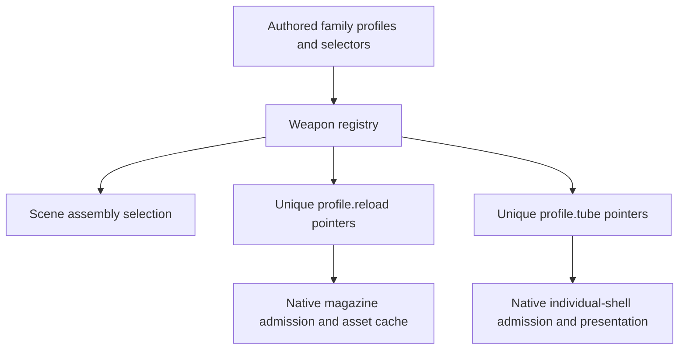

# Weapon registration

The entry point for registering reviewed weapon assemblies is
[`weapon_registry.hpp`](../src/client/component/vr/gameplay/weapon_registry.hpp).
It connects assembly profiles to their selectors. Detachable-magazine and
individual-shell feed catalogs are generated from those profiles, so adding a
weapon no longer requires a second manually maintained reload list.

## Source map

All paths below are relative to `src/client/component/vr/gameplay/`.

| File | Responsibility |
| --- | --- |
| `weapons/<family>/profile.hpp` | Authored assembly variants, poses, capability pointers, and any family selector |
| `weapon_registry.hpp` | The single list of admitted assemblies and their selectors |
| `weapon_registration.hpp` | Registration helpers and bounded, deduplicated capability views |
| `weapon_profiles.hpp` | Validate scene ranges, find the receiver, and dispatch its registered selector |
| `weapon_profile_binding.hpp` | Shared binding for profiles with simple hidden/visible attachment contracts |
| `weapon_attachments.hpp` | Bone topology, attachment role, cardinality, and muzzle validation |
| `weapon_reload_profiles.hpp` | Derived detachable-magazine catalog and exact native admission |
| `tube_profiles.hpp` | Derived individual-shell catalog and exact native admission |
| `break_action_profiles.hpp` | Derived hinged-chamber catalog and exact native admission |



The directory stores pointers to immutable, process-lifetime profiles. It does
not own weapon instances, ammunition, render resources, or mutable game state.

## Add a weapon or variant

1. Author the reviewed data under `weapons/<family>/`. Set the assembly's
   `reload`, `tube`, `cylinder`, or `break_open` pointer for its primary feed. A support grip or
   underbarrel attachment does not itself authorize a second ammunition feed.
2. For an assembly with only the shared attachment policy, use a null selector.
   When multiple variants share a receiver, provide one family selector that
   validates the full assembly and returns the appropriate authored profile.
   All registrations for that receiver must use that same selector.
3. Include the family header and add one group in `weapon_registry.hpp`:

   ```cpp
   register_profiles(nullptr, m9::base),
   register_profiles(usp::select, usp::base, usp::silenced),
   register_profiles(ak47::select, ak47::assemblies),
   ```

   An array registers all its elements. When using individual objects, list
   every variant the selector can return. Selection rejects a returned profile
   that is not registered with that selector and receiver.
4. Add accepted and rejected assembly fixtures, exact native-name/capacity
   checks, and any mechanical interaction tests. Update the catalog regression
   expectations when intentionally adding supported recipes.

No edits to the two derived feed lists are needed. Family-specific attachment
rules stay in the family directory; the dispatcher contains no weapon-name
branches. The suppressed USP uses the shared binder after selecting its
explicit variant, retaining its knife mask and suppressor muzzle validation.

## Identity, ordering, and cache bounds

- Capability lists deduplicate by pointer identity. Grips sharing a recipe use
  one cache slot. Independently authored recipes remain distinct even when
  they share mechanical values or native names.
- Registration order determines the default recipe for native-only lookup.
  Put the default before its alternate skins. Scene-aware lookup requires the
  exact registered recipe and still checks native name and capacity.
- Capability views are initialized after their authored profiles and use fixed
  storage bounded by the number of registered assemblies. They allocate no
  heap storage and introduce no per-frame synchronization.
- `size` counts usable recipes; `capacity` is only a storage bound. An
  unknown reload pointer maps to the `size` sentinel, which must be rejected
  even if an asset array has spare capacity. Cache indices are internal and
  must not be serialized or used as native weapon IDs.

## Separate native policies

`weapon_mechanics_profiles.hpp` remains the explicit opt-in policy for the
native chamber/plus-one adapter. Registering a physical reload profile does not
enable that separate adapter; open-bolt weapons must not inherit it.

The .44 Magnum assembly is in the directory, but cylinder admission and its
speedloader/rendering path are still specialized in `cylinder_runtime.cpp` and
`cylinder_presenter.cpp`. Registering another cylinder profile alone does not
implement a new revolver. Generalizing that path requires its own reviewed
native and presentation contracts.

The riot shield registers a `defense` capability without an ammunition feed.
Its dedicated rig contract retains the native socket solely for model alignment
and skin matching; the published frame explicitly disallows firing. See the
[shield boundary and acceptance notes](vr-riot-shield.md). Non-firing weapons
must not be represented by dummy ammunition profiles.

The special inventory knives register a `melee` capability and a reviewed rig
with no muzzle. Their exact native identities opt out of ammunition and bullet
delivery despite the original definitions reporting bullet type. See
[special knives](vr-special-knives.md) for world-model reconstruction and the
separate ending-script boundary.

## Verification

`tests/vr/weapon_registry_tests.hpp` runs inside `vr-weapon-grip-tests`, including
in the existing CI job. It checks the 48 detachable recipes and five
individual-shell recipes retained by this refactor, their default precedence,
unregistered recipe rejection, and consistent registration of shared receivers.
The weapon fixtures in that executable exercise the existing family selectors.
`vr-pistol-profile-tests`, `vr-physical-reload-tests`, `vr-cylinder-tests`, and
`vr-spatial-panel-tests` provide related interaction and presentation coverage.

Generate projects with `tools/premake5 vs2022 --with-vr-tests`, build the client
and these test projects, and run their executables. A CPU test pass is not HMD
acceptance of new poses or native game behavior.
